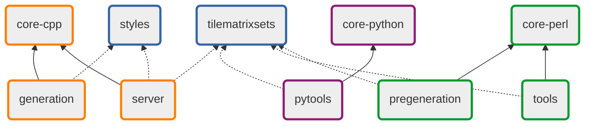
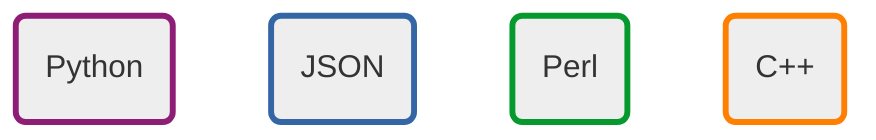
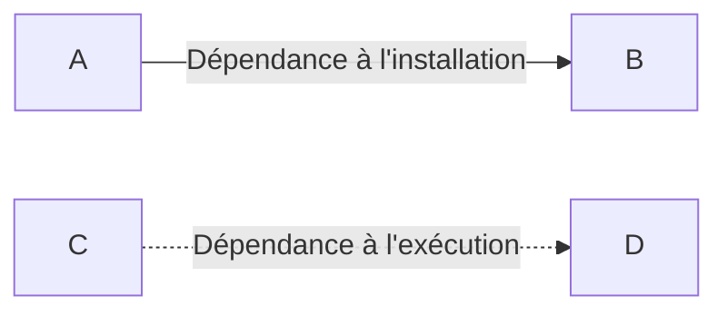

# Dépendances

```mermaid
graph BT
    
    STL(styles)
    TMS(tilematrixsets)
    GEN(generation)
    SERV(server)
    CCPP(core-cpp)
    CPYT(core-python)
    CPER(core-perl)
    PTO(pytools)
    PREG(pregeneration)
    TOOL(tools)

    GEN --> CCPP
    SERV --> CCPP
    PTO --> CPYT
    PREG --> CPER
    TOOL --> CPER

    GEN -.-> STL
    SERV -.-> STL
    SERV -.-> TMS
    PTO -.-> TMS
    TOOL -.-> TMS
    PREG -.-> TMS

    classDef python fill:#eee,stroke:#8d1d75,stroke-width:3px;
    classDef json fill:#eee,stroke:#3465a4,stroke-width:3px;
    classDef cpp fill:#eee,stroke:#ff8000,stroke-width:3px;
    classDef perl fill:#eee,stroke:#069a2e,stroke-width:3px;

    class PTO,CPYT python
    class STL,TMS json
    class SERV,CCPP,GEN cpp
    class CPER,PREG,TOOL perl
```

#### Légende

```mermaid
graph BT
    
    PYTHON(Python)
    JSON(JSON)
    PERL(Perl)
    CPP(C++)
    
    classDef python fill:#eee,stroke:#8d1d75,stroke-width:3px;
    classDef json fill:#eee,stroke:#3465a4,stroke-width:3px;
    classDef cpp fill:#eee,stroke:#ff8000,stroke-width:3px;
    classDef perl fill:#eee,stroke:#069a2e,stroke-width:3px;

    class PYTHON python
    class JSON json
    class CPP cpp
    class PERL perl
```

```mermaid
graph LR
    A -- Dépendance à l'installation --> B
    C -. Dépendance à l'exécution .-> D
```